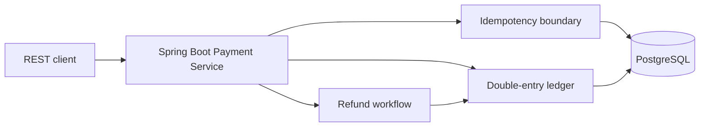

# LedgerForge

LedgerForge is a multi-tenant payment and double-entry accounting backend built with Java 21, Spring Boot 3, PostgreSQL, Flyway, Docker Compose, JUnit, and Testcontainers.

This first milestone deliberately focuses on accounting correctness before adding a dashboard. It implements idempotent payment capture, balanced immutable journal entries, partial refunds, and protection against concurrent over-refunds.

## Architecture



## Accounting model

A captured USD 125.50 payment creates one immutable journal transaction:

| Account | Debit | Credit |
|---|---:|---:|
| Cash clearing | 125.50 | — |
| Merchant payable | — | 125.50 |

A refund creates a new reversing transaction. Existing journal rows are never updated or deleted. Every posting is validated with `BigDecimal`, normalized to two decimal places without rounding, and rejected unless total debits equal total credits.

## Run with Docker

```bash
docker compose up --build -d
./scripts/smoke-test.sh
```

The API listens on `http://localhost:8080`; health is available at `/actuator/health`.

## API example

```bash
curl -X POST http://localhost:8080/api/payments \
  -H 'X-Organization-Id: 00000000-0000-4000-8000-000000000001' \
  -H 'Idempotency-Key: checkout-001' \
  -H 'content-type: application/json' \
  -d '{"amount":125.50,"currency":"USD"}'
```

Reusing the key with the same payload returns the original payment. Reusing it with a different amount or currency returns HTTP `409`.

## Tests

Maven is not required on the host when Docker is available:

```bash
docker run --rm -v "$PWD:/workspace" -w /workspace \
  -v ledgerforge_maven_cache:/root/.m2 \
  -v /var/run/docker.sock:/var/run/docker.sock \
  maven:3.9.11-eclipse-temurin-21 mvn verify
```

The integration suite starts PostgreSQL with Testcontainers and verifies:

- payment idempotency and payload conflicts;
- debit/credit equality;
- partial and full refunds;
- two concurrent refunds cannot exceed the captured amount;
- PostgreSQL itself rejects unbalanced or mutated journal history.

## Current scope

Implemented now: ledger, payment capture, refunds, idempotency, concurrency control, immutable history, Docker, tests, and CI.

Planned only after the accounting core remains green: authentication/RBAC, wallets, fees/taxes, signed webhooks and outbox, reconciliation, reporting, and the Next.js dashboard.

All seeded identifiers and credentials are local demonstration values. No real payment data or credentials are included.
