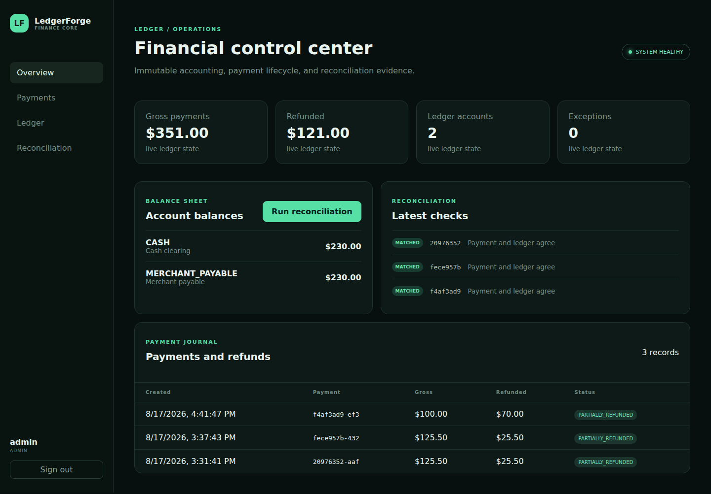
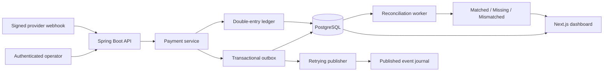

# LedgerForge

LedgerForge is a multi-tenant payment and double-entry accounting platform built with Java 21, Spring Boot 3, Next.js, PostgreSQL, Flyway, Docker Compose, JUnit, Testcontainers, and Vitest.

It demonstrates financial correctness under retries, duplicates, out-of-order delivery, and concurrent refunds. All data and credentials are synthetic.



## Architecture



The payment, ledger entries, audit receipt, and outbox record commit atomically. The publisher can crash after the database commit without losing the event; on restart it claims the persisted row and uses the outbox ID as the delivery deduplication key.

## Demonstrated flow

```text
Signed refund webhook arrives early → stored as PENDING
Signed payment webhook arrives       → HMAC verified and payment captured
Pending refund                       → applied exactly once
Ledger                               → debit equals credit
Outbox                               → published with persistent retries
Two concurrent refunds              → one succeeds, one is rejected
Reconciliation                       → MATCHED or explicit exception
Dashboard                            → complete payment and journal history
```

Run the exact scenario with:

```bash
docker compose up --build -d --wait
./scripts/smoke-test.sh
```

Open the dashboard at [http://localhost:3002](http://localhost:3002). API health is available at [http://localhost:8080/actuator/health](http://localhost:8080/actuator/health).

## Demo access

| Organization | Email | Password | Role |
|---|---|---|---|
| `demo` | `admin@ledgerforge.dev` | `LedgerForge123!` | admin |
| `demo` | `operator@ledgerforge.dev` | `LedgerForge123!` | operator |
| `demo` | `auditor@ledgerforge.dev` | `LedgerForge123!` | auditor |
| `acme` | `admin@acme.test` | `AcmeLedger123!` | admin |

Admins and operators can capture/refund payments and run reconciliation. Auditors have read-only access. Every authenticated API query derives its organization from the signed JWT; clients cannot choose another tenant with a header.

## Signed webhook

Provider signatures use lowercase hexadecimal HMAC-SHA256 over:

```text
<unix_timestamp>.<raw_request_body>
```

Required headers are `X-Webhook-Id`, `X-Webhook-Timestamp`, and `X-Webhook-Signature`. Duplicate provider event IDs return the stored result. Refunds received before their capture remain `PENDING` and are processed in occurrence order after the payment arrives.

The local demo secrets are `whsec_demo_ledgerforge` and `whsec_acme_ledgerforge`; replace them before any non-local deployment.

## Accounting guarantees

A captured USD 125.50 payment creates:

| Account | Debit | Credit |
|---|---:|---:|
| Cash clearing | 125.50 | — |
| Merchant payable | — | 125.50 |

- Money uses `BigDecimal`/PostgreSQL `numeric(19,2)`, never binary floating point.
- Application and deferred PostgreSQL constraints reject unbalanced transactions.
- Ledger transactions and entries cannot be updated or deleted.
- Refunds append reversing entries rather than rewriting history.
- `SELECT … FOR UPDATE` serializes concurrent refunds.
- `(organization_id, idempotency_key)` prevents duplicate payment processing.

## Outbox failure drill

`outbox_events` is written in the same transaction as the payment. Delivery writes to the append-only `published_events` journal and then marks the outbox row published. Failed rows use exponential retry scheduling. The integration test injects a persisted delivery failure and proves the transition `FAILED → retry → PUBLISHED` without event loss.

## Reconciliation and reporting

Reconciliation compares expected net payment value (`captured - refunded`) with net cash represented by the ledger:

- `MATCHED`: payment and ledger agree;
- `MISSING`: the payment has no capture journal transaction;
- `MISMATCHED`: expected and ledger amounts differ.

The API and dashboard expose account balances, payments, refunds, ledger entries, and reconciliation exceptions.

## Tests

Maven is not required on the host:

```bash
docker run --rm -v "$PWD:/workspace" -w /workspace \
  -v ledgerforge_maven_cache:/root/.m2 \
  -v /var/run/docker.sock:/var/run/docker.sock \
  maven:3.9.11-eclipse-temurin-21 mvn verify

cd dashboard
npm ci
npm test
npm run build
```

The suite covers accounting invariants, immutable history, idempotency conflicts, partial and concurrent refunds, HMAC validation, duplicate/out-of-order webhooks, tenant isolation, RBAC, durable outbox retries, and reconciliation.

## Intentional v1 limits

- One simulated payment provider and USD demo accounts.
- PostgreSQL-backed event publication instead of Kafka.
- No complex wallets, fee engine, tax engine, or payout settlement.
- JWT revocation and key rotation are not implemented.
- Reconciliation is operational consistency checking, not external bank-statement settlement.

These limits keep the demonstration focused on transaction correctness rather than breadth.
